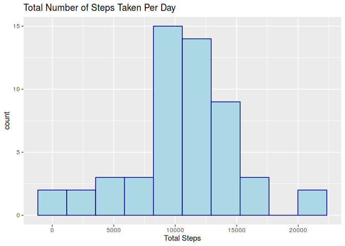
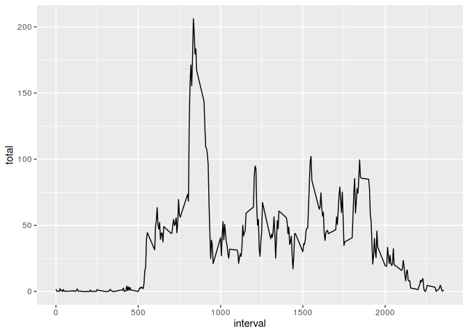
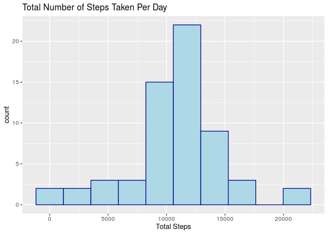
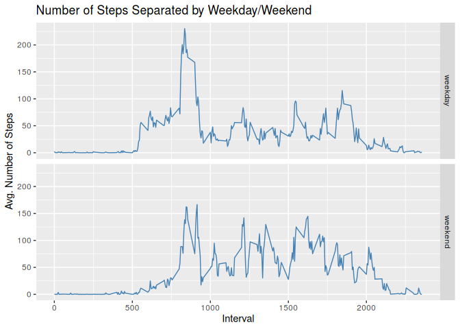

```r
unzip("./activity.zip", exdir = ".")
```

### Loading and preprocessing the data


```r
library(ggplot2)
library(dplyr)
activity <- read.csv("activity.csv")
```

---

### What is the mean number of steps taken per day?

Since entire days are "NA", using `na.rm = T` in `sum()` results in '0' for that day which is a misrepresentation of that day.

It should be "NA", not '0', and this gives a false mean and median later.

For this reason, `na.rm = T` was used for `mean()` and `median()` rather than `sum()`.


```r
totalsteps <- activity %>% 
            group_by(date) %>% 
            summarise(total = sum(steps))

ggplot(totalsteps, aes(total)) + 
    geom_histogram(color = "darkblue", fill = "lightblue", bins = 10) + 
    labs(title = "Total Number of Steps Taken Per Day", 
         x = "Total Steps")
```

<!-- -->


```r
mean(totalsteps$total, na.rm = T)
```

```
## [1] 10766.19
```


```r
median(totalsteps$total, na.rm = T)
```

```
## [1] 10765
```

The mean steps taken per day was found to be 10766.19 while the median steps taken per day was found to be 10765.

---

### What is the average daily activity pattern?


```r
meansteps <- activity %>% 
            group_by(interval) %>% 
            summarise(total = mean(steps, na.rm = T))

ggplot(meansteps, aes(interval, total)) + geom_line()
```

<!-- -->


```r
meansteps[which.max(meansteps$total), ]
```

```
## # A tibble: 1 x 2
##   interval total
##      <int> <dbl>
## 1      835  206.
```

The 5-minute interval with the maximum average number of steps was found to be 835.

---

### Imputing missing values.


```r
sum(is.na(activity$steps))
```

```
## [1] 2304
```

This dataset contains 2304 'NA's.


```r
activityNoNA <- activity
for(i in which(is.na(activityNoNA$steps))) {
    intervalVal <- activityNoNA$interval[i]
    intervalLoc <- which(meansteps$interval == intervalVal)
    activityNoNA$steps[i] <- meansteps$total[intervalLoc]
}
```

This loop imputes the missing data with the mean for the corresponding time interval.


```r
totalsteps <- activityNoNA %>% 
            group_by(date) %>% 
            summarise(total = sum(steps))

ggplot(totalsteps, aes(total)) + 
    geom_histogram(color = "darkblue", fill = "lightblue", bins = 10) + 
    labs(title = "Total Number of Steps Taken Per Day", 
         x = "Total Steps")
```

<!-- -->


```r
mean(totalsteps$total)
```

```
## [1] 10766.19
```


```r
median(totalsteps$total)
```

```
## [1] 10766.19
```

The mean steps taken per day was found to be 10766.19 while the median steps taken per day was also found to be 10766.19.

---

### Are there differences in activity patterns between weekdays and weekends?


```r
activityNoNA$day <- weekdays(as.Date(activityNoNA$date))
weekend <- activityNoNA$day %in% c("Saturday", "Sunday")
activityNoNA$daytype <- "NA"
activityNoNA$daytype[weekend] <- "weekend"
activityNoNA$daytype[!weekend] <- "weekday"
activityNoNA$daytype <- as.factor(activityNoNA$daytype)

meansteps <- activityNoNA %>% 
            group_by(interval, daytype) %>% 
            summarise(total = mean(steps))

ggplot(meansteps, aes(interval, total)) + 
    geom_line(color = "steelblue") + 
    facet_grid(daytype~.) + 
    labs(x = "Interval", 
         y = "Avg. Number of Steps", 
         title = "Number of Steps Separated by Weekday/Weekend")
```

<!-- -->

There appears to be more activity in the <1000 interval region on weekdays, but more activity in the >1000 interval region on weekends. Activity also appears to begin later and end later on weekends.
